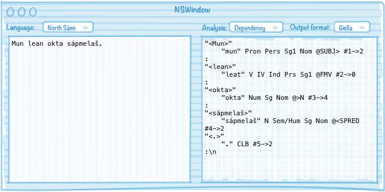

# Graphical text analysis application for linguists

There is a growing interest in linguistic research on the languages we work with. And although a lot of research can be done using the [Korp web service](http://gtweb.uit.no/korp/), some researchers would like to use their own texts, or perform other types of analyses than what is provided there. Finally, Korp – being a web service – only works with a network connection.

Installing our language packages and all their dependencies is a huge task for most people, and after installation, our tools can still only be used on the command line, giving only one type of output.

We thus want to build a graphical UI app that contains all the necessary machinery to perform linguistic analyses of input text, and which can format the analysis output in several ways according to the user’s choice. It should be easy to extend the output formatting with new formats.

# Deliverables

## Basic features of the app
* paste text, get analysed text in a different window/pane:
    * syntactic tree structure/dependency tree
    * there should be different formatting/rendering options for the analysis
      output (see mockup below)
    * it should be possible to copy the displayed analysis in a suitable format
      (specified in the app settings), so that one can easily paste it into
      other applications, e.g. when writing academic papers
* analysers/processing pipelines (one per language) should be automatically
  updated via the Páhkat repository
* the app is essentially a graphical wrapper around libdivvun + `zcheck` files:
    * text used as input to libdivvun in one pane
    * output appears in the other pane
    * processing is done as specified in the `zcheck` file for the given
      language
* the application should be made for all of macOS, Windows and Linux using
  native code for the UI parts. No generic UI libraries should be used!
  This is done to get application behavior and look&feel that properly follows
  the guidelines and user expectations of each platform
* all regular keyboard shortcuts as per conventions on each supported platform should be available, plus additional app-specific keyboard shortcuts. The exact list of app-specific keyboard shortcuts will be defined as part of the development process.

Also have a look at
[Apertium Simpleton](http://wiki.apertium.org/wiki/Apertium_Simpleton_UI) for
inspiration.

GUI mockup:

## Notes

* the **Analysis** popup menu is just a listing of the available pipelines for the selected language, as returned by libdivvun
* **Output format** is a list of whatever final reformatting we choose to provide as part of the app — it should at be a reasonable selection of formats, like:
    * Giella (a «raw» format)
    * UD
    * common formats used in linguistic litterature
    * the *default* format should be setable in the app settings
* the **Language** popup must list all and only the languages returned by libdivvun
* the mockup above is in no way binding, it is just to visualise the basic functionality of the app
* the file suffix `zcheck` is used in this specification for the file containing the linguistic data and the actual pipeline specifications, as that is the suffix used for a similar pipeline file for grammar checking. In the final app the file suffix will most likely be different.
* command line interface, to allow piping text into it, possibly also analysis results out of it
* other possible functionality:
    * display more morphophonological info and other info based on lexc entry
    * Korp searches triggered from analysis window (e.g. to see other uses of the lemma)
    * extract frequency lists? Other linguistic analysis tools?

See also the
[Oslo LAP](https://www.mn.uio.no/ifi/english/research/projects/clarino/) web
app.

## Target user groups

Linguists and researchers wanting to use our analysis tools without having to compile and set up a large number of different things. This app (obtained via the Páhkat clients) should be a one-stop-get-it-all for researchers interested in the languages in the Giella infra.

## Possible future extension

* tool or interface to provide user feedback - missing words, wrong analyses, etc
* one pane for each analysis step?
    * each pane could be editable, so that corrections can be made, and the corrected data would then be used as input for the subsequent processing steps/panes?

## Compatibility requirements

* Windows 7+
* macOS 10.8+
* Linux

## Acceptance requirements

[Standard requirements](GeneralInfo.md).
